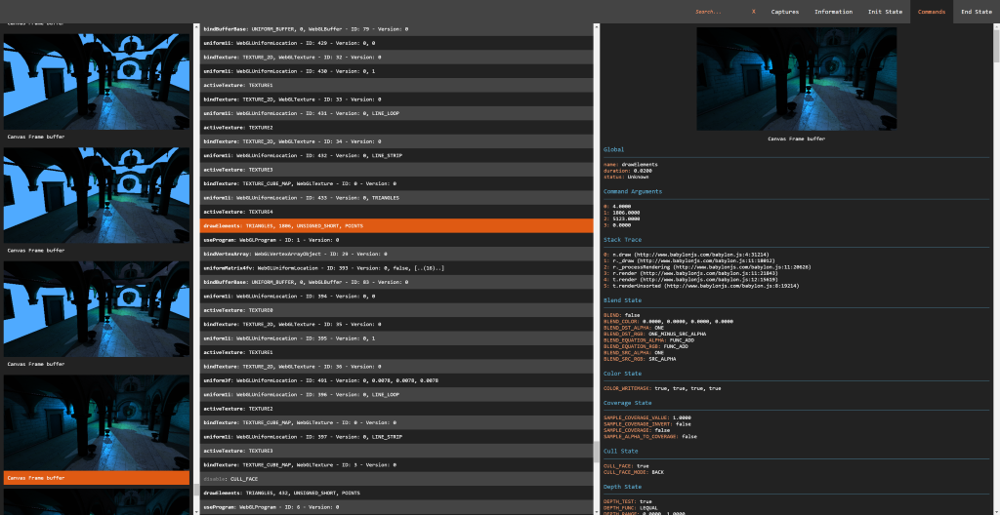
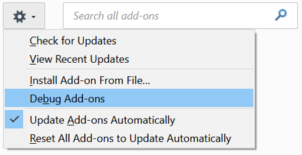
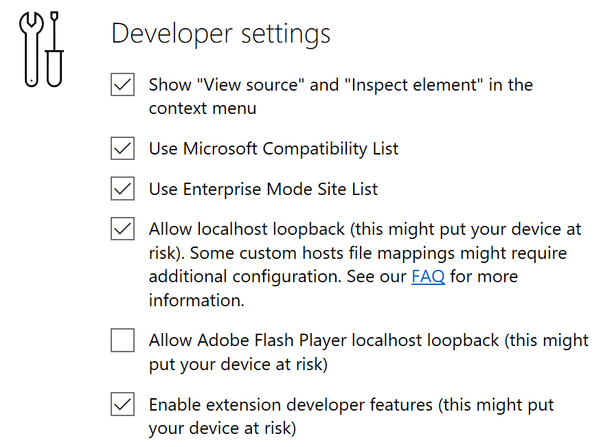
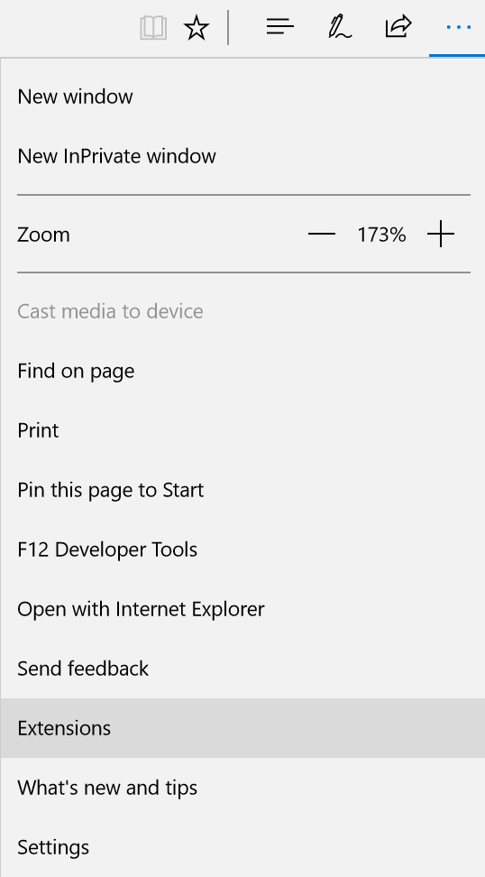
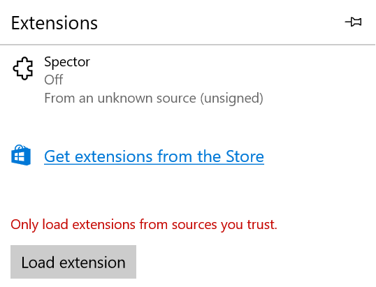
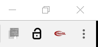
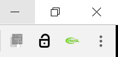
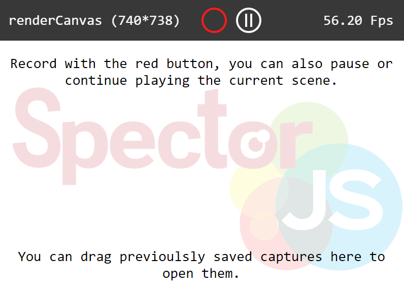
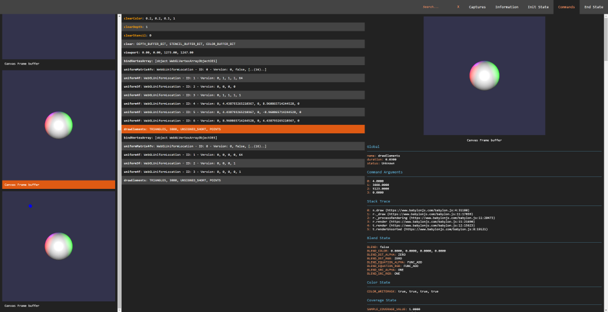

SpectorJS 
=========

## Summary
**Explore and Troubleshoot your WebGL scenes (All engines and Vanilla script support) with ease.**

Spector is a tool aim to *WebGl* developers willing to know what happens on their context. It enables capturing all the available information from a frame. You will be empowered to look at your entire **commands list** with their asoociated **visual states** and **context information**.

[](https://travis-ci.org/BabylonJS/Spector.js)

This can be used either as a *browser extension* or directly form your page.

<p align="center">
  
</p>

## Why
As a core member of the BabylonJS team I often found the need of debugging what is happening to my webgl context. I was a huge fan of webgl inspector until we introduce WebGl2 in Babylon. As the WebGL community as a whole is our focus, I thought it would be great to share an extension compatible with all the Webgl/Webgl2 engines available.

## How to use the extension
The extension has been designed to be cross browser. As it is not currently deployed to the browser extension marketplace, you can easily sideload it in your browser of choice. 

### Install in Chrome
1. Navigate to [Chrome Extensions](chrome://extensions/)
2. Enable the developer Mode (Checkbox on the top right of the extension page)
3. Cick on the Load Unpacke Extension (Button on the top left of the extension page)
    <p align="center">
        
    </p>
4. Select the folder *extensions* from the cloned repository.
5. You are all set. 

### Install in Firefox
1. Navigate to [Firefox Add Ons](about:addons)
2. Click settings and Debug Add-ons.
3. Cick on the Load Unpacked Extension (Button on the top left of the extension page)
    <p align="center">
        
    </p>
4. Click on load temporary Add-on.
5. Select the folder *extensions* from the cloned repository.
6. You are all set. 

### Install on Edge
1. Navigate to [Flags](about:flags)
2. Enable extension developer feature.
    <p align="center">
        
    </p>
4. In the settings menu click on Extensions.
    <p align="center">
        
    </p>
5. Click on Load extension.
    <p align="center">
        
    </p>
5. Select the folder *extensions* from the cloned repository.
6. You are all set.

### How To Use
You can now on navigate to any website using webgl like the [Babylon JS playground](http://www.babylonjs-playground.com/?6) and you will notice the extension Icon turning red in the toolbar.
<p align="center">
    
</p>

This means a canvas with a 3d context has been detected in one of the page frames. From this point you can inject all the required capture tooling in the page by pressing the toolbar button. This will reload the page and the icon should turn green as it is enabled.
<p align="center">
    
</p>

Now a click on the button will display a popup helping you capturing frames.
<p align="center">
    
</p>

Following the on screen instructions and clicking the red button will trigger a capture. You can also, in this menu, if a canvas is selected pause or play frame by frame the rendered canvas. Once the capture has been completed, a result panel will be displayed containing all the information you may need.
<p align="center">
    
</p>

## How to embed
The library available in the build folder is easy to embed. You can simply add the following tag in your html page header:

```html
<script type="text/javascript" src="spector.bundle.js"></script>
```

Once done, you can statt the spector library by inserting the following command in your script:

```javascript
var spector = new SPECTOR.Spector();
```

You can then display the capture UI directly in your page:

```javascript
spector.displayUI();
```

Or launch a capture and reuse its JSON result at your will:

```javascript
spector.onCapture.add((capture) => {
    // Do something with capture.
    var myEvent = new CustomEvent("SpectorOnCaptureEvent", { detail: { captureString: JSON.stringify(capture) } });
    document.dispatchEvent(myEvent);
});

var canvas = document.getElementById("renderCanvas");
spector.captureCanvas(canvas);
```

## How to build and use locally
Like any simple typescript repository everything start with.

```
git clone https://github.com/BabylonJS/SpectorJS.git
cd spector
npm install
```

Then you can use the following npm commands to speed your development:
1. ```npm start``` Will compile and run a local server with a watch command so that you can directly try your changes (TS or scss). Navigate to the the [embedded sample](localhost:1337/sample/index.html) to start playing with the dev tools.
2. ```npm run build``` Will create and build a new version of the dist folder files.
3. ```npm run clean``` Will clean all the generated files from the repo.

If you are looking for the temporary generated .js or .map files, they are all available in the built folder which is not under source control.

I would recommend developping on [VsCode](https://code.visualstudio.com/) as the entire setup is present so that if you install the chrome debugger extension you can directly debug from your typescript files by pressing f5.

## Contribute
Any bugs are welcomed as Github issues. And if you are willing to help, do not hesitate to make a Pull Request.

## If you do not understand Spector or WebGL
I would advise you to check out and start with the Awesome [BabylonJS](http://www.babylonjs.com/) the community there will be more than happy to welcome anybody willing to learn Web 3d.

<p align="center">
    
</p>